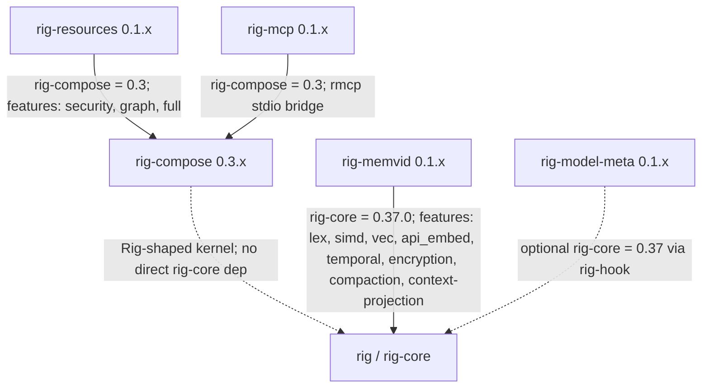

# rig-resources

Reusable skills, tools, behavior patterns, and resource adapters for rig-compose agents.

[](https://github.com/ForeverAngry/rig-resources/actions/workflows/ci.yml)
[](https://crates.io/crates/rig-resources)
[](https://docs.rs/rig-resources)
[](#license)
[](#status)

## Overview

`rig-resources` is the reusable implementation layer for `rig-compose` agents. Where `rig-compose` defines the kernel traits and registries, this crate supplies concrete baseline stores, baseline tools, memory lookup tools, behavior-pattern skills, memory-pivot skills, optional graph resources, and optional security-oriented skills.

The default build is intentionally small. Graph resources are behind `graph`; security primitives are behind `security`; `full` enables both.

## Why it exists

Agent systems built on `rig-compose` need common resources that should not live inside the kernel: statistical baselines, behavior-pattern registries, graph pivots, memory lookup pivots, and reusable security detections. `rig-resources` provides those pieces as `rig_compose::Skill` and `rig_compose::Tool` implementations so downstream agents can register them without duplicating kernel surfaces.

## Status

- Crate version: `0.1.4`.
- Rust edition: 2024.
- MSRV: 1.88.
- Runtime stance: runtime-agnostic library; `tokio` is only a dev-dependency.
- `rig-compose` dependency: `version = "0.3"`.
- Current Unreleased work adds the canonical `memory.lookup` tool contract,
    streaming baseline accumulation, ECS-to-security-signal helpers, resource
    context projection helpers, and a local resource trace envelope.

The crate-local maturity plan lives in [ROADMAP.md](ROADMAP.md). Cross-crate
coordination lives in
[`rig-contributions/docs/roadmap.md`](../rig-contributions/docs/roadmap.md).

## Feature Flags

| Feature | Default | Enables | Checked by `just check` |
| --- | --- | --- | --- |
| none | yes | Baseline store/tool, online baseline accumulator, memory lookup tool, behavior-pattern registry/skill, baseline compare skill, and memory pivot skill. | default clippy and test runs |
| `security` | no | Namespaced security skills in [src/security](src/security): credential, ECS signal helpers, exfil, lateral, and recon modules. | clippy and tests with `--features security` |
| `graph` | no | `petgraph`-backed graph store, graph tool, and graph expansion skill from [src/graph](src/graph). | clippy and tests with `--features graph` |
| `full` | no | Convenience feature enabling `security` and `graph`. | clippy and tests with `--features full`; docs with all features |

## Key Types

- [src/baseline.rs](src/baseline.rs): `BaselineStore`, `InMemoryBaselineStore`, `EntityBaseline`, `OnlineStats`, `BaselineCompareTool`, and `BaselineError`. The tool returns availability and in-bound flags for an observed value against mean plus or minus `k * std_dev`; `OnlineStats` builds baselines from streaming observations.
- [src/memory.rs](src/memory.rs): `MemoryLookupStore`, `MemoryLookupHit`, `MemoryLookupTool`, and `MemoryLookupError`. The tool is named `memory.lookup`, matching `MemoryPivotSkill`.
- [src/patterns.rs](src/patterns.rs): `BehaviorPattern`, `BehaviorRegistry`, `BehaviorPatternSkill`, `PatternRule`, and `PatternId`. Patterns are append-style, versioned rules over `InvestigationContext` signals.
- [src/projection.rs](src/projection.rs): `IntoContextItem` plus helpers for projecting behavior patterns, baselines, memory hits, and accumulated evidence into `rig_compose::ContextItem` / `ContextPack`.
- [src/skills.rs](src/skills.rs): `BaselineCompareSkill` and `MemoryPivotSkill`. The baseline skill suppresses confidence for in-baseline behavior; the memory skill calls a registered `memory.lookup` tool after confidence crosses a threshold.
- [src/trace.rs](src/trace.rs): `ResourceTraceEnvelope`, a crate-local JSON envelope for resource evidence metadata while cross-kernel trace shapes are still being proven.
- [src/graph/store.rs](src/graph/store.rs): `GraphStore`, `GraphEdge`, `Subgraph`, and `GraphError`, gated behind `graph`.
- [src/graph/inmem.rs](src/graph/inmem.rs): `InMemoryGraph`, a `petgraph::DiGraph`-backed implementation with idempotent edge upserts and degree-style centrality.
- [src/graph/tool.rs](src/graph/tool.rs): `GraphTool`, a `rig_compose::Tool` named `graph.entity` with `upsert`, `expand`, and `centrality` operations.
- [src/graph/skills.rs](src/graph/skills.rs): `GraphExpansionSkill` and `GraphExpansionConfig`, which lift confidence when an entity's expanded graph fan-out exceeds a threshold.
- [src/security](src/security): optional domain skills including `HighFanoutSkill`, `EntropyCheckSkill`, `SlowBeaconSkill`, credential, ECS signal helpers, lateral, and exfil modules.

## Integration With Rig

`rig-resources` integrates through `rig-compose`, not directly through `rig-core`. It pins `rig-compose` as `version = "0.3"` in [Cargo.toml](Cargo.toml).

All exported skills implement `rig_compose::Skill`; exported tools implement `rig_compose::Tool`. That means agents register them in `SkillRegistry` and `ToolRegistry` the same way they register caller-defined local logic.

## Usage

The baseline path is covered by unit tests in [src/baseline.rs](src/baseline.rs). This example mirrors `tool_reports_available_and_within` while avoiding test-only unwraps.

```rust,no_run
use std::sync::Arc;

use rig_compose::Tool;
use rig_resources::{
    BaselineCompareTool, BaselineStore, EntityBaseline, InMemoryBaselineStore,
};
use serde_json::json;

# async fn run() -> Result<(), Box<dyn std::error::Error>> {
let store: Arc<dyn BaselineStore> = InMemoryBaselineStore::arc();
store
    .put(EntityBaseline {
        entity: "host-1".into(),
        metric: "fanout".into(),
        mean: 100.0,
        std_dev: 5.0,
        samples: 128,
    })
    .await?;

let tool = BaselineCompareTool::new(store);
let output = tool
    .invoke(json!({"entity": "host-1", "metric": "fanout", "value": 102.0, "k": 2.0}))
    .await?;

assert_eq!(output.get("available").and_then(serde_json::Value::as_bool), Some(true));
assert_eq!(output.get("within").and_then(serde_json::Value::as_bool), Some(true));
# Ok(()) }
```

Graph behavior is covered by tests in [src/graph/tool.rs](src/graph/tool.rs), [src/graph/skills.rs](src/graph/skills.rs), and [src/graph/inmem.rs](src/graph/inmem.rs) when the `graph` feature is enabled.

## Validation

Canonical validation is `just check`.

That recipe runs formatter checks, clippy and tests for default, `security`, `graph`, and `full`, then rustdoc with all features and `-D warnings -D rustdoc::broken_intra_doc_links`.

## Gotchas

- `MemoryPivotSkill` does not provide storage. Register `MemoryLookupTool` with a backend implementing `MemoryLookupStore`, or register another compatible tool named `memory.lookup`.
- `BaselineCompareTool` treats missing baselines as an unavailable result, not as a tool failure.
- `GraphExpansionSkill` treats `KernelError::ToolNotApplicable` from `GraphTool` as sparse context and returns `SkillOutcome::noop()`.
- Projection helpers are caller-side: they convert existing records or accumulated evidence into `ContextItem`s without adding fields to `rig_compose::InvestigationContext`.
- The graph feature pulls in `petgraph`; keep graph-specific code gated behind `#[cfg(feature = "graph")]`.
- The library uses `parking_lot` guards. Do not hold guards across `.await` points.

## Ecosystem

These companion crates are maintained as separate repositories. Together they form a small stack around the upstream Rig project: `rig-compose` provides the kernel surface, `rig-resources` contributes reusable skills and tools, `rig-mcp` moves tools across MCP, `rig-memvid` connects Rig agents to persistent `.mv2` memory, and `rig-model-meta` abstracts LLM metadata and probes.



Pinned Rig-facing dependencies from the current manifests:

| Crate | Direct Rig-facing dependency | Notes |
| --- | --- | --- |
| `rig-compose` | none | Defines a Rig-shaped kernel surface without depending on `rig-core`. |
| `rig-resources` | `rig-compose = 0.3` | Provides reusable skills, resource tools, and security helpers. |
| `rig-mcp` | `rig-compose = 0.3` | Bridges `rig-compose` tools over MCP stdio and loopback transports. |
| `rig-memvid` | `rig-core = 0.37.0`; optional `rig-compose = 0.3` | Implements Rig vector-store, prompt-hook, compaction, and context-projection flows over Memvid. |
| `rig-model-meta` | optional `rig-core = 0.37` via `rig-hook` | Provides standalone model traits plus optional Rig prompt-hook telemetry. |

The concrete multi-crate workflow tested today is the MCP loopback path: a `rig_compose::ToolRegistry` is exposed through `rig_mcp::LoopbackTransport`, remote schemas are wrapped as `rig_mcp::McpTool`, and the wrapped tools are registered back into another `ToolRegistry`. That proves a local `rig-compose` tool and an MCP-adapted tool are indistinguishable to callers. The backing test is `mcp_tool_indistinguishable_from_local` in [rig-mcp/src/transport.rs](https://github.com/ForeverAngry/rig-mcp/blob/main/src/transport.rs).

## License

Licensed under either Apache-2.0 or MIT, at your option.
